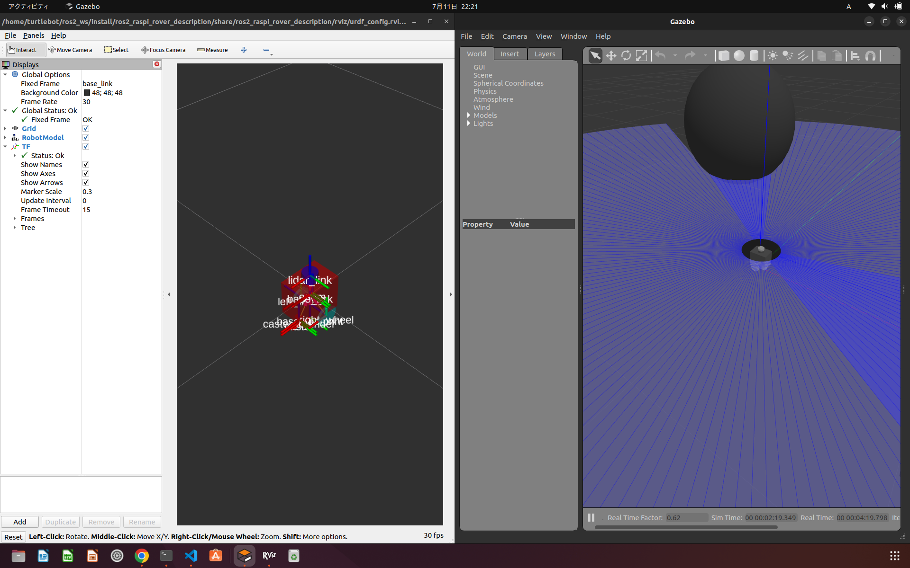
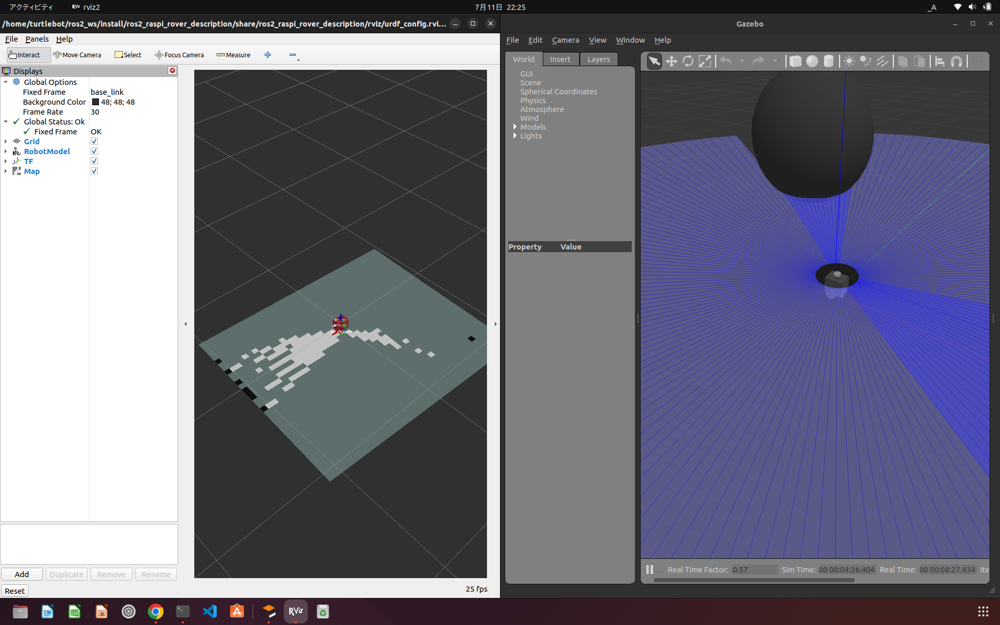
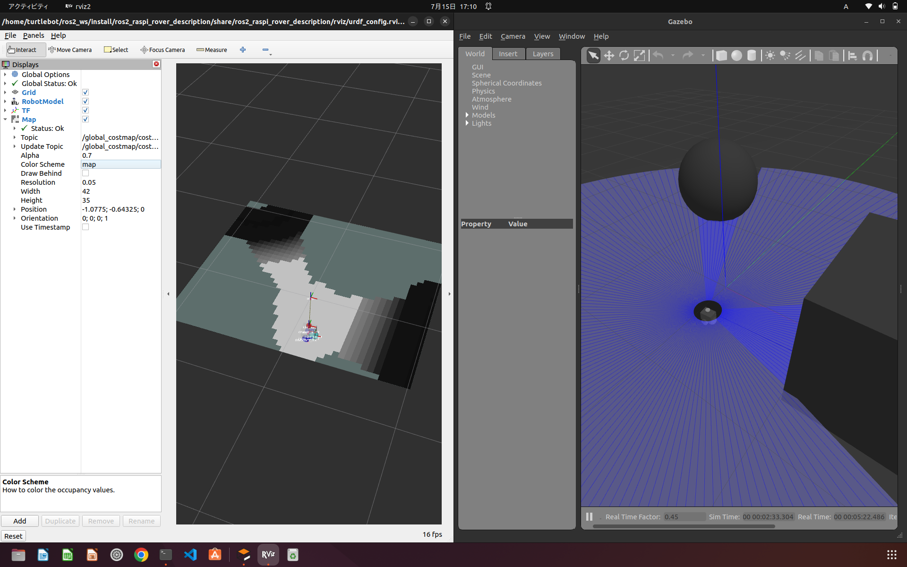
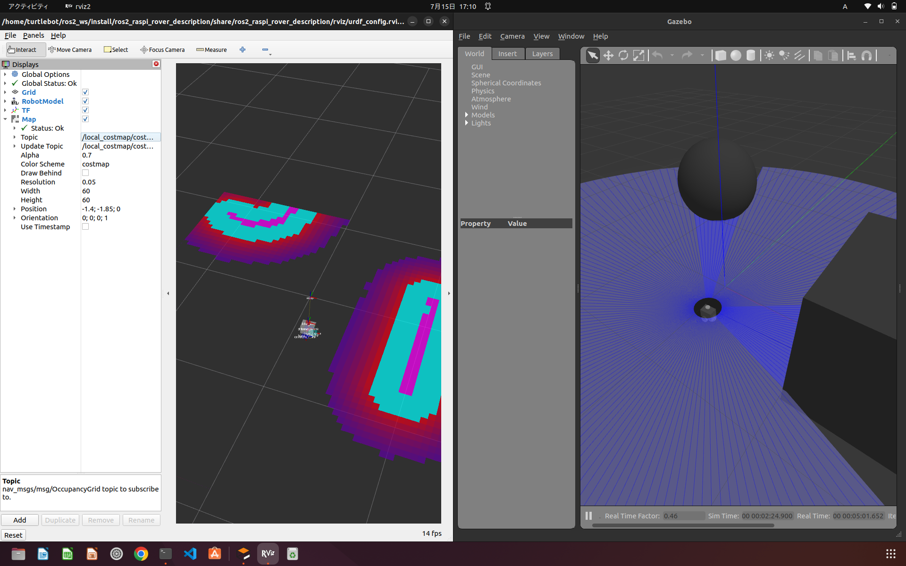

# raspi_rover_description

このレポジトリはこの[チュートリアル](https://navigation.ros.org/setup_guides/urdf/setup_urdf.html)に基づいて作成されました。

## 依存関係の解決

```bash
sudo apt install ros-humble-joint-state-publisher-gui
sudo apt install ros-humble-xacro
sudo apt install ros-humble-gazebo-ros-pkgs
sudo apt install ros-humble-slam-toolbox
sudo apt install ros-humble-navigation2
sudo apt install ros-humble-nav2-bringup
//必要に応じて
sudo apt install ros-humble-ros-gz
sudo apt install ros-foxy-rmw-cyclonedds-cpp
export export RMW_IMPLEMENTATION=rmw_cyclonedds_cpp 
//デフォルトのfast-RTPSだと特有のバグがあるらしい
```

## ビルド

```bash
cd ros2_ws
colcon build --symlink-install
```

## 実行

- in teminal1

```bash
ros2 launch ros2_raspi_rover_description display.launch.py use_sim_time:=true
```

gazeboとrviz2が立ち上がり、物理シュミレーションとロボットの内部状態の可視化が始まる。

```bash
ros2 launch ros2_raspi_rover_description display.launch.py
[INFO] [launch]: All log files can be found below /home/turtlebot/.ros/log/2023-07-11-22-16-37-836094-turtlebot-CFSZ5-2L-6759
[INFO] [launch]: Default logging verbosity is set to INFO
[INFO] [gazebo-1]: process started with pid [6761]
[INFO] [joint_state_publisher-2]: process started with pid [6763]
[INFO] [robot_state_publisher-3]: process started with pid [6765]
[INFO] [spawn_entity.py-4]: process started with pid [6767]
[INFO] [ekf_node-5]: process started with pid [6769]
[INFO] [rviz2-6]: process started with pid [6772]
[rviz2-6] Warning: Ignoring XDG_SESSION_TYPE=wayland on Gnome. Use QT_QPA_PLATFORM=wayland to run on Wayland anyway.
[robot_state_publisher-3] [WARN] [1689081398.381003305] [kdl_parser]: The root link base_link has an inertia specified in the URDF, but KDL does not support a root link with an inertia.  As a workaround, you can add an extra dummy link to your URDF.
[robot_state_publisher-3] [INFO] [1689081398.383196398] [robot_state_publisher]: got segment base_footprint
[robot_state_publisher-3] [INFO] [1689081398.384240422] [robot_state_publisher]: got segment base_link
[robot_state_publisher-3] [INFO] [1689081398.385155106] [robot_state_publisher]: got segment caster
[robot_state_publisher-3] [INFO] [1689081398.385984557] [robot_state_publisher]: got segment caster_cylinder
[robot_state_publisher-3] [INFO] [1689081398.386877932] [robot_state_publisher]: got segment left_wheel
[robot_state_publisher-3] [INFO] [1689081398.387782694] [robot_state_publisher]: got segment lidar_link
[robot_state_publisher-3] [INFO] [1689081398.388720231] [robot_state_publisher]: got segment right_wheel
[joint_state_publisher-2] [INFO] [1689081399.120429785] [joint_state_publisher]: Waiting for robot_description to be published on the robot_description topic...
[spawn_entity.py-4] [INFO] [1689081399.303324831] [spawn_entity]: Spawn Entity started
[spawn_entity.py-4] [INFO] [1689081399.304298002] [spawn_entity]: Loading entity published on topic robot_description
[spawn_entity.py-4] /opt/ros/humble/local/lib/python3.10/dist-packages/rclpy/qos.py:307: UserWarning: DurabilityPolicy.RMW_QOS_POLICY_DURABILITY_TRANSIENT_LOCAL is deprecated. Use DurabilityPolicy.TRANSIENT_LOCAL instead.
[spawn_entity.py-4]   warnings.warn(
[spawn_entity.py-4] [INFO] [1689081399.308522600] [spawn_entity]: Waiting for entity xml on robot_description
[spawn_entity.py-4] [INFO] [1689081399.319738003] [spawn_entity]: Waiting for service /spawn_entity, timeout = 30
[spawn_entity.py-4] [INFO] [1689081399.320560853] [spawn_entity]: Waiting for service /spawn_entity
[gazebo-1] Gazebo multi-robot simulator, version 11.10.2
[gazebo-1] Copyright (C) 2012 Open Source Robotics Foundation.
[gazebo-1] Released under the Apache 2 License.
[gazebo-1] http://gazebosim.org
[gazebo-1] 
[gazebo-1] Gazebo multi-robot simulator, version 11.10.2
[gazebo-1] Copyright (C) 2012 Open Source Robotics Foundation.
[gazebo-1] Released under the Apache 2 License.
[gazebo-1] http://gazebosim.org
[gazebo-1] 
[rviz2-6] [INFO] [1689081399.581675799] [rviz2]: Stereo is NOT SUPPORTED
[rviz2-6] [INFO] [1689081399.581920222] [rviz2]: OpenGl version: 4.6 (GLSL 4.6)
[rviz2-6] [INFO] [1689081399.630054018] [rviz2]: Stereo is NOT SUPPORTED
[spawn_entity.py-4] [INFO] [1689081400.581761534] [spawn_entity]: Calling service /spawn_entity
[spawn_entity.py-4] [INFO] [1689081400.938152551] [spawn_entity]: Spawn status: SpawnEntity: Successfully spawned entity [ros2_raspi_rover]
[gazebo-1] [INFO] [1689081401.066564088] [diff_drive]: Wheel pair 1 separation set to [0.087500m]
[gazebo-1] [INFO] [1689081401.067496899] [diff_drive]: Wheel pair 1 diameter set to [0.060000m]
[gazebo-1] [INFO] [1689081401.069530593] [diff_drive]: Subscribed to [/cmd_vel]
[gazebo-1] [INFO] [1689081401.074315534] [diff_drive]: Advertise odometry on [/odom]
[INFO] [spawn_entity.py-4]: process has finished cleanly [pid 6767]
```


上記ログと画面が出れば成功。
URDFの定義が汚いとロボットが転んだり、LIDARが傾いたりする。
慣性モーメントが非現実的というエラーも出るたまに。

- in terminal2

```bash
ros2 launch slam_toolbox online_async_launch.py use_sim_time:=true
```

slamが実行され、自己位置推定と地図作成が開始される。rvizで/mapを追加し可視化すると
既知領域（移動可能）既知領域（障害物）と未知領域の/mapが作成されているのがわかる。

```bash
[INFO] [launch]: All log files can be found below /home/turtlebot/.ros/log/2023-07-11-22-24-06-148711-turtlebot-CFSZ5-2L-7904
[INFO] [launch]: Default logging verbosity is set to INFO
[INFO] [async_slam_toolbox_node-1]: process started with pid [7907]
[async_slam_toolbox_node-1] [INFO] [1689081847.942501369] [slam_toolbox]: Node using stack size 40000000
[async_slam_toolbox_node-1] [INFO] [1689081848.285260282] [slam_toolbox]: Using solver plugin solver_plugins::CeresSolver
[async_slam_toolbox_node-1] [INFO] [1689081848.286567586] [slam_toolbox]: CeresSolver: Using SCHUR_JACOBI preconditioner.
[async_slam_toolbox_node-1] Info: clipped range threshold to be within minimum and maximum range!
[async_slam_toolbox_node-1] Registering sensor: [Custom Described Lidar]
```


上記ログと画像が出れば成功。
/mapがロボットの移動とともに作られるようになる。
なおロボット移動させたいならば、以下実行する。

- in terminal3

```bash
ros2 run teleop_twist_keyboard teleop_twist_keyboard
//パッケージがない場合は
sudo apt install ros-humble-teleop-twist-keyboard
```

```bash
ros2 run teleop_twist_keyboard teleop_twist_keyboard 

This node takes keypresses from the keyboard and publishes them
as Twist messages. It works best with a US keyboard layout.
---------------------------
Moving around:
   u    i    o
   j    k    l
   m    ,    .

For Holonomic mode (strafing), hold down the shift key:
---------------------------
   U    I    O
   J    K    L
   M    <    >

t : up (+z)
b : down (-z)

anything else : stop

q/z : increase/decrease max speeds by 10%
w/x : increase/decrease only linear speed by 10%
e/c : increase/decrease only angular speed by 10%

CTRL-C to quit

currently: speed 0.5 turn 1.0
```

このようなログが出る。/cmd_velトピックにnav_msgs/Twist型のメッセージを送るノードを立ち上げた。
速度はデフォルトだと早すぎるので`speed 0.2`位を目安に`x`キーで減速してからコマンド打つ。

- in terminal4

```bash
ros2 launch nav2_bringup navigation_launch.py use_sim_time:=true
```

```bash
[INFO] [launch]: All log files can be found below /home/turtlebot/.ros/log/2023-07-15-20-18-35-577423-turtlebot-CFSZ5-2L-5901
[INFO] [launch]: Default logging verbosity is set to INFO
[INFO] [controller_server-1]: process started with pid [5927]
[INFO] [smoother_server-2]: process started with pid [5929]
[INFO] [planner_server-3]: process started with pid [5931]
[INFO] [behavior_server-4]: process started with pid [5933]
[INFO] [bt_navigator-5]: process started with pid [5935]
[INFO] [waypoint_follower-6]: process started with pid [5937]
[INFO] [velocity_smoother-7]: process started with pid [5939]
[INFO] [lifecycle_manager-8]: process started with pid [5941]
[waypoint_follower-6] [INFO] [1689419922.237441569] [waypoint_follower]: 
[waypoint_follower-6]  waypoint_follower lifecycle node launched. 
[waypoint_follower-6]  Waiting on external lifecycle transitions to activate
[waypoint_follower-6]  See https://design.ros2.org/articles/node_lifecycle.html for more information.
[smoother_server-2] [INFO] [1689419922.276917500] [smoother_server]: 
[smoother_server-2]  smoother_server lifecycle node launched. 
[smoother_server-2]  Waiting on external lifecycle transitions to activate
[smoother_server-2]  See https://design.ros2.org/articles/node_lifecycle.html for more information.
[bt_navigator-5] [INFO] [1689419922.300505799] [bt_navigator]: 
[bt_navigator-5]  bt_navigator lifecycle node launched. 
[bt_navigator-5]  Waiting on external lifecycle transitions to activate
[bt_navigator-5]  See https://design.ros2.org/articles/node_lifecycle.html for more information.
[waypoint_follower-6] [INFO] [1689419922.301062986] [waypoint_follower]: Creating
[bt_navigator-5] [INFO] [1689419922.301731128] [bt_navigator]: Creating
[smoother_server-2] [INFO] [1689419922.437563413] [smoother_server]: Creating smoother server
[planner_server-3] [INFO] [1689419922.545866570] [planner_server]: 
[planner_server-3]  planner_server lifecycle node launched. 
[planner_server-3]  Waiting on external lifecycle transitions to activate
[planner_server-3]  See https://design.ros2.org/articles/node_lifecycle.html for more information.
[planner_server-3] [INFO] [1689419922.660452542] [planner_server]: Creating
[behavior_server-4] [INFO] [1689419922.879208164] [behavior_server]: 
[behavior_server-4]  behavior_server lifecycle node launched. 
[behavior_server-4]  Waiting on external lifecycle transitions to activate
[behavior_server-4]  See https://design.ros2.org/articles/node_lifecycle.html for more information.
[controller_server-1] [INFO] [1689419922.970348322] [controller_server]: 
[controller_server-1]  controller_server lifecycle node launched. 
[controller_server-1]  Waiting on external lifecycle transitions to activate
[controller_server-1]  See https://design.ros2.org/articles/node_lifecycle.html for more information.
[lifecycle_manager-8] [INFO] [1689419922.994013974] [lifecycle_manager_navigation]: Creating
[planner_server-3] [INFO] [1689419922.994654984] [global_costmap.global_costmap]: 
[planner_server-3]  global_costmap lifecycle node launched. 
[planner_server-3]  Waiting on external lifecycle transitions to activate
[planner_server-3]  See https://design.ros2.org/articles/node_lifecycle.html for more information.
[planner_server-3] [INFO] [1689419923.055531382] [global_costmap.global_costmap]: Creating Costmap
[controller_server-1] [INFO] [1689419923.082206754] [controller_server]: Creating controller server
[velocity_smoother-7] [INFO] [1689419923.083369500] [velocity_smoother]: 
[velocity_smoother-7]  velocity_smoother lifecycle node launched. 
[velocity_smoother-7]  Waiting on external lifecycle transitions to activate
[velocity_smoother-7]  See https://design.ros2.org/articles/node_lifecycle.html for more information.
[lifecycle_manager-8] [INFO] [1689419923.293704680] [lifecycle_manager_navigation]: Creating and initializing lifecycle service clients
[controller_server-1] [INFO] [1689419923.439306358] [local_costmap.local_costmap]: 
[controller_server-1]  local_costmap lifecycle node launched. 
[controller_server-1]  Waiting on external lifecycle transitions to activate
[controller_server-1]  See https://design.ros2.org/articles/node_lifecycle.html for more information.
[controller_server-1] [INFO] [1689419923.441419027] [local_costmap.local_costmap]: Creating Costmap
[lifecycle_manager-8] [INFO] [1689419925.173042811] [lifecycle_manager_navigation]: Starting managed nodes bringup...
[lifecycle_manager-8] [INFO] [1689419925.173178543] [lifecycle_manager_navigation]: Configuring controller_server
[controller_server-1] [INFO] [1689419925.180550185] [controller_server]: Configuring controller interface
[controller_server-1] [INFO] [1689419925.182223132] [controller_server]: getting goal checker plugins..
[controller_server-1] [INFO] [1689419925.182774366] [controller_server]: Controller frequency set to 20.0000Hz
[controller_server-1] [INFO] [1689419925.182977193] [local_costmap.local_costmap]: Configuring
[controller_server-1] [INFO] [1689419925.209962205] [local_costmap.local_costmap]: Using plugin "voxel_layer"
[controller_server-1] [INFO] [1689419925.257066650] [local_costmap.local_costmap]: Subscribed to Topics: scan
[controller_server-1] [INFO] [1689419925.328488860] [local_costmap.local_costmap]: Initialized plugin "voxel_layer"
[controller_server-1] [INFO] [1689419925.328573743] [local_costmap.local_costmap]: Using plugin "inflation_layer"
[controller_server-1] [INFO] [1689419925.330400007] [local_costmap.local_costmap]: Initialized plugin "inflation_layer"
[controller_server-1] [INFO] [1689419925.430394367] [controller_server]: Created progress_checker : progress_checker of type nav2_controller::SimpleProgressChecker
[controller_server-1] [INFO] [1689419925.463610875] [controller_server]: Created goal checker : general_goal_checker of type nav2_controller::SimpleGoalChecker
[controller_server-1] [INFO] [1689419925.484851963] [controller_server]: Controller Server has general_goal_checker  goal checkers available.
[controller_server-1] [INFO] [1689419925.538177109] [controller_server]: Created controller : FollowPath of type dwb_core::DWBLocalPlanner
[controller_server-1] [INFO] [1689419925.566788649] [controller_server]: Setting transform_tolerance to 0.200000
[controller_server-1] [INFO] [1689419925.690218917] [controller_server]: Using critic "RotateToGoal" (dwb_critics::RotateToGoalCritic)
[controller_server-1] [INFO] [1689419925.696263162] [controller_server]: Critic plugin initialized
[controller_server-1] [INFO] [1689419925.697062904] [controller_server]: Using critic "Oscillation" (dwb_critics::OscillationCritic)
[controller_server-1] [INFO] [1689419925.700072777] [controller_server]: Critic plugin initialized
[controller_server-1] [INFO] [1689419925.700655289] [controller_server]: Using critic "BaseObstacle" (dwb_critics::BaseObstacleCritic)
[controller_server-1] [INFO] [1689419925.701602336] [controller_server]: Critic plugin initialized
[controller_server-1] [INFO] [1689419925.702233169] [controller_server]: Using critic "GoalAlign" (dwb_critics::GoalAlignCritic)
[controller_server-1] [INFO] [1689419925.710213399] [controller_server]: Critic plugin initialized
[controller_server-1] [INFO] [1689419925.711939905] [controller_server]: Using critic "PathAlign" (dwb_critics::PathAlignCritic)
[controller_server-1] [INFO] [1689419925.715682589] [controller_server]: Critic plugin initialized
[controller_server-1] [INFO] [1689419925.716433640] [controller_server]: Using critic "PathDist" (dwb_critics::PathDistCritic)
[controller_server-1] [INFO] [1689419925.717883357] [controller_server]: Critic plugin initialized
[controller_server-1] [INFO] [1689419925.718887043] [controller_server]: Using critic "GoalDist" (dwb_critics::GoalDistCritic)
[controller_server-1] [INFO] [1689419925.719958373] [controller_server]: Critic plugin initialized
[controller_server-1] [INFO] [1689419925.720020409] [controller_server]: Controller Server has FollowPath  controllers available.
[lifecycle_manager-8] [INFO] [1689419925.787169952] [lifecycle_manager_navigation]: Configuring smoother_server
[smoother_server-2] [INFO] [1689419925.788630514] [smoother_server]: Configuring smoother server
[smoother_server-2] [INFO] [1689419925.903457673] [smoother_server]: Created smoother : simple_smoother of type nav2_smoother::SimpleSmoother
[smoother_server-2] [INFO] [1689419925.939870208] [smoother_server]: Smoother Server has simple_smoother  smoothers available.
[lifecycle_manager-8] [INFO] [1689419926.053778072] [lifecycle_manager_navigation]: Configuring planner_server
[planner_server-3] [INFO] [1689419926.054527229] [planner_server]: Configuring
[planner_server-3] [INFO] [1689419926.054709444] [global_costmap.global_costmap]: Configuring
[planner_server-3] [INFO] [1689419926.102871914] [global_costmap.global_costmap]: Using plugin "static_layer"
[planner_server-3] [INFO] [1689419926.164280664] [global_costmap.global_costmap]: Subscribing to the map topic (/map) with transient local durability
[planner_server-3] [INFO] [1689419926.199054824] [global_costmap.global_costmap]: Initialized plugin "static_layer"
[planner_server-3] [INFO] [1689419926.199124475] [global_costmap.global_costmap]: Using plugin "obstacle_layer"
[planner_server-3] [INFO] [1689419926.200539591] [global_costmap.global_costmap]: Subscribed to Topics: scan
[planner_server-3] [INFO] [1689419926.224952085] [global_costmap.global_costmap]: Initialized plugin "obstacle_layer"
[planner_server-3] [INFO] [1689419926.225117659] [global_costmap.global_costmap]: Using plugin "inflation_layer"
[planner_server-3] [INFO] [1689419926.227922267] [global_costmap.global_costmap]: Initialized plugin "inflation_layer"
[planner_server-3] [INFO] [1689419926.293126836] [global_costmap.global_costmap]: StaticLayer: Resizing costmap to 43 X 35 at 0.050000 m/pix
[planner_server-3] [INFO] [1689419926.298292198] [planner_server]: Created global planner plugin GridBased of type nav2_navfn_planner/NavfnPlanner
[planner_server-3] [INFO] [1689419926.298471059] [planner_server]: Configuring plugin GridBased of type NavfnPlanner
[planner_server-3] [INFO] [1689419926.303659608] [planner_server]: Planner Server has GridBased  planners available.
[lifecycle_manager-8] [INFO] [1689419926.420245003] [lifecycle_manager_navigation]: Configuring behavior_server
[behavior_server-4] [INFO] [1689419926.421333512] [behavior_server]: Configuring
[behavior_server-4] [INFO] [1689419926.595029110] [behavior_server]: Creating behavior plugin spin of type nav2_behaviors/Spin
[behavior_server-4] [INFO] [1689419926.615907398] [behavior_server]: Configuring spin
[behavior_server-4] [INFO] [1689419926.691727445] [behavior_server]: Creating behavior plugin backup of type nav2_behaviors/BackUp
[behavior_server-4] [INFO] [1689419926.699075135] [behavior_server]: Configuring backup
[behavior_server-4] [INFO] [1689419926.762313692] [behavior_server]: Creating behavior plugin drive_on_heading of type nav2_behaviors/DriveOnHeading
[behavior_server-4] [INFO] [1689419926.781026844] [behavior_server]: Configuring drive_on_heading
[behavior_server-4] [INFO] [1689419926.835650146] [behavior_server]: Creating behavior plugin assisted_teleop of type nav2_behaviors/AssistedTeleop
[behavior_server-4] [INFO] [1689419926.869831975] [behavior_server]: Configuring assisted_teleop
[behavior_server-4] [INFO] [1689419926.997254144] [behavior_server]: Creating behavior plugin wait of type nav2_behaviors/Wait
[behavior_server-4] [INFO] [1689419927.019634055] [behavior_server]: Configuring wait
[lifecycle_manager-8] [INFO] [1689419927.053908671] [lifecycle_manager_navigation]: Configuring bt_navigator
[bt_navigator-5] [INFO] [1689419927.055370431] [bt_navigator]: Configuring
[lifecycle_manager-8] [INFO] [1689419927.990699637] [lifecycle_manager_navigation]: Configuring waypoint_follower
[waypoint_follower-6] [INFO] [1689419927.992902450] [waypoint_follower]: Configuring
[waypoint_follower-6] [INFO] [1689419928.133163278] [waypoint_follower]: Created waypoint_task_executor : wait_at_waypoint of type nav2_waypoint_follower::WaitAtWaypoint
[lifecycle_manager-8] [INFO] [1689419928.194341438] [lifecycle_manager_navigation]: Configuring velocity_smoother
[velocity_smoother-7] [INFO] [1689419928.195039319] [velocity_smoother]: Configuring velocity smoother
[lifecycle_manager-8] [INFO] [1689419928.233072930] [lifecycle_manager_navigation]: Activating controller_server
[controller_server-1] [INFO] [1689419928.233637874] [controller_server]: Activating
[controller_server-1] [INFO] [1689419928.233714258] [local_costmap.local_costmap]: Activating
[controller_server-1] [INFO] [1689419928.233745032] [local_costmap.local_costmap]: Checking transform
[controller_server-1] [INFO] [1689419928.234062855] [local_costmap.local_costmap]: start
[controller_server-1] [INFO] [1689419928.487859379] [controller_server]: Creating bond (controller_server) to lifecycle manager.
[lifecycle_manager-8] [INFO] [1689419928.639124475] [lifecycle_manager_navigation]: Server controller_server connected with bond.
[lifecycle_manager-8] [INFO] [1689419928.639274291] [lifecycle_manager_navigation]: Activating smoother_server
[smoother_server-2] [INFO] [1689419928.640909241] [smoother_server]: Activating
[smoother_server-2] [INFO] [1689419928.641130778] [smoother_server]: Creating bond (smoother_server) to lifecycle manager.
[lifecycle_manager-8] [INFO] [1689419928.759665596] [lifecycle_manager_navigation]: Server smoother_server connected with bond.
[lifecycle_manager-8] [INFO] [1689419928.760092828] [lifecycle_manager_navigation]: Activating planner_server
[planner_server-3] [INFO] [1689419928.765279987] [planner_server]: Activating
[planner_server-3] [INFO] [1689419928.765512815] [global_costmap.global_costmap]: Activating
[planner_server-3] [INFO] [1689419928.765581825] [global_costmap.global_costmap]: Checking transform
[planner_server-3] [INFO] [1689419928.765876659] [global_costmap.global_costmap]: start
[planner_server-3] [INFO] [1689419929.771693497] [planner_server]: Activating plugin GridBased of type NavfnPlanner
[planner_server-3] [INFO] [1689419929.781415280] [planner_server]: Creating bond (planner_server) to lifecycle manager.
[lifecycle_manager-8] [INFO] [1689419929.933510759] [lifecycle_manager_navigation]: Server planner_server connected with bond.
[lifecycle_manager-8] [INFO] [1689419929.934008881] [lifecycle_manager_navigation]: Activating behavior_server
[behavior_server-4] [INFO] [1689419929.944137731] [behavior_server]: Activating
[behavior_server-4] [INFO] [1689419929.944246733] [behavior_server]: Activating spin
[behavior_server-4] [INFO] [1689419929.944289529] [behavior_server]: Activating backup
[behavior_server-4] [INFO] [1689419929.944323611] [behavior_server]: Activating drive_on_heading
[behavior_server-4] [INFO] [1689419929.944661737] [behavior_server]: Activating assisted_teleop
[behavior_server-4] [INFO] [1689419929.944716621] [behavior_server]: Activating wait
[behavior_server-4] [INFO] [1689419929.944759829] [behavior_server]: Creating bond (behavior_server) to lifecycle manager.
[lifecycle_manager-8] [INFO] [1689419930.084423980] [lifecycle_manager_navigation]: Server behavior_server connected with bond.
[lifecycle_manager-8] [INFO] [1689419930.084684908] [lifecycle_manager_navigation]: Activating bt_navigator
[bt_navigator-5] [INFO] [1689419930.086398881] [bt_navigator]: Activating
[bt_navigator-5] [INFO] [1689419930.868177731] [bt_navigator]: Creating bond (bt_navigator) to lifecycle manager.
[lifecycle_manager-8] [INFO] [1689419931.050545375] [lifecycle_manager_navigation]: Server bt_navigator connected with bond.
[lifecycle_manager-8] [INFO] [1689419931.060891912] [lifecycle_manager_navigation]: Activating waypoint_follower
[waypoint_follower-6] [INFO] [1689419931.065568753] [waypoint_follower]: Activating
[waypoint_follower-6] [INFO] [1689419931.065675762] [waypoint_follower]: Creating bond (waypoint_follower) to lifecycle manager.
[lifecycle_manager-8] [INFO] [1689419931.298083123] [lifecycle_manager_navigation]: Server waypoint_follower connected with bond.
[lifecycle_manager-8] [INFO] [1689419931.298336480] [lifecycle_manager_navigation]: Activating velocity_smoother
[velocity_smoother-7] [INFO] [1689419931.301811100] [velocity_smoother]: Activating
[velocity_smoother-7] [INFO] [1689419931.302044136] [velocity_smoother]: Creating bond (velocity_smoother) to lifecycle manager.
[lifecycle_manager-8] [INFO] [1689419931.485637947] [lifecycle_manager_navigation]: Server velocity_smoother connected with bond.
[lifecycle_manager-8] [INFO] [1689419931.527892074] [lifecycle_manager_navigation]: Managed nodes are active
[lifecycle_manager-8] [INFO] [1689419931.531749161] [lifecycle_manager_navigation]: Creating bond timer...
```

ロボットの経路計算に使われるコストマップが表示される。




## Turtlebot3_world.worldでシュミレーション

```bash
//turtlebot3のgazeboモデルを読み込みたい
sudo apt install ros-humble-turtlebot3-gazebo
export GAZEBO_MODEL_PATH=$GAZEBO_MODEL_PATH:/opt/ros/humble/share/turtlebot3_gazebo/models
//raspi_roverのモデルでGazeboとRvizを起動したい。（各種設定はURDFに書いてある）
ros2 launch ros2_raspi_rover_description in_tb3.launch.py use_sim_time:=true
//map->base_linkのtf変換をpublishかつ自己位置推定を実行したい
ros2 launch nav2_bringup slam_launch.py use_sim_time:=true
//地図作成しながら自律移動するなら上記、しないなら下記
ros2 launch nav2_bringup localization_launch.py use_sim_time:=true map:=/home/turtlebot/ros2_ws/src/ros2_raspi_rover_description/maps/sim_map.yaml
//Nav2の諸々（behavior,smoother,controller,planner,bt_navigator,waypoint_follwer,vel_smoother,life_cycle）をローンチしたい
ros2 launch nav2_bringup navigation_launch.py use_sim_time:=true
```
